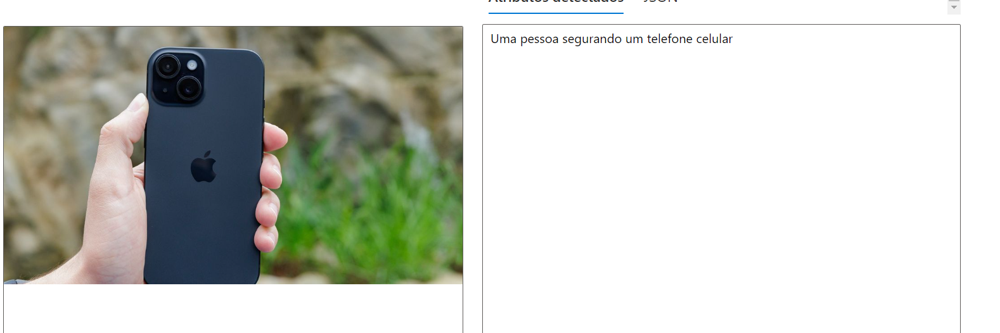
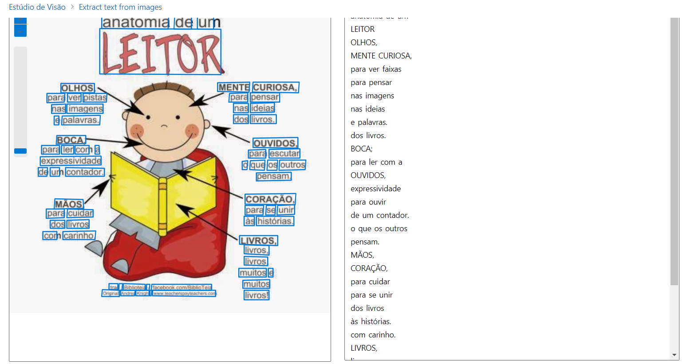

!

Pude perceber que o sistema detalhe de maneira consistente o produto visto na imagem e que de certa forma poderia ser usado em E-commerces ou Marketplaces para facilitar o acesso a deficientes visuais.

*

mas por outro lado, puder perceber que a IA não distingue marcar, apenas define que tipo de produto é aquele

Posso observar que ele de fato reconhe o texto contido na imagem, mas embaralha os textos
